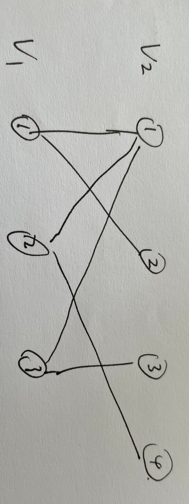
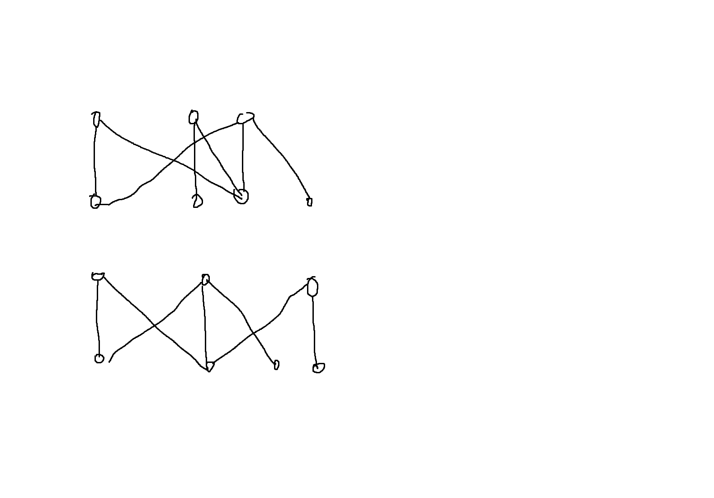
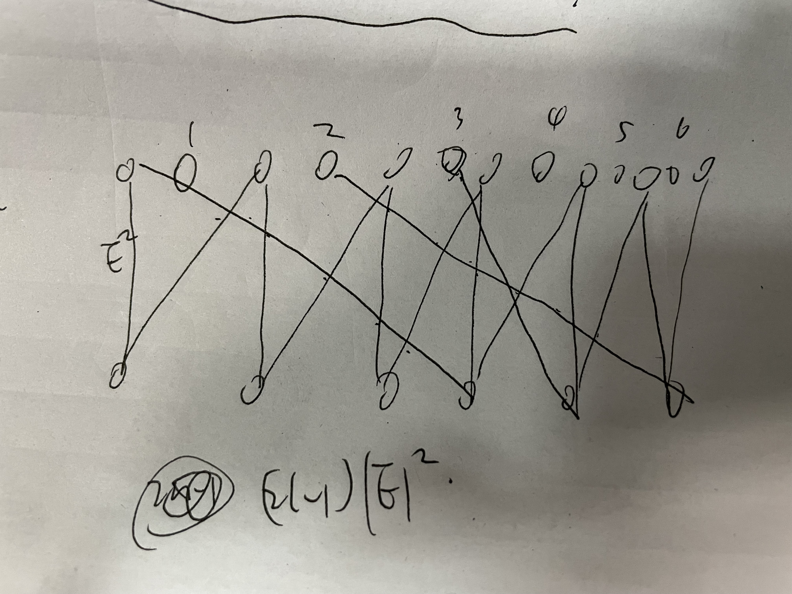

最近遇到一个问题：给出二分图$G(V_1,V_2,E)$，$E\subset V_1 \times V_2$求两侧顶点排序使得边的交叉数量最少。


[Crossing-Number-Is-NP-Complete_Garey_Johnson.pdf](https://learn.fmi.uni-sofia.bg/pluginfile.php/160153/mod_resource/content/4/Crossing-Number-Is-NP-Complete_Garey_Johnson.pdf)
证明了是NP-Hard，所以考虑一些启发式方法。

首先考虑固定其中一边的情况，假设$V_2$固定，而$V_1$可动，求$V_1$的一个排列使得边的交叉最少。

这种情况下下我们可以被固定的$V_2$编号，然后对于可动的$V_1$的某个排列，按顺序写出$V_1$中每个点连接到的$V_2$中的点的编号，
形成了一个序列，交叉点的数量相当于序列当中的逆序对数



写出的序列为V_1: ```[1 2] [1 4] [1 3]```

逆序对有四个，对应着图中的四个交点

### 1

然后我提出一个问题，加入一种对$V_1$的这个排列的修改操作，可以将某个点插入到某个位置，如何维护逆序对个数?

经过分析，实际上需要维护的是在插入操作下的区间大于某个值的数字的个数，和同学讨论了一下本以为用树状数组套权值线段树可以解决，结果发现插入会改变树状数组每个节点分配的序列区间，并不能行，主席树（可持久化权值线段树）也不知道怎么做这种点的插入的维护，这个问题仍然没有解决


### 2 (5/17)

[有人](http://scis.scichina.com/cn/2021/SSI-2019-0122.pdf)用local search，先固定一侧$V_1$，对另一侧$V_2$用dp求在限制下的最优解，然后按照最优解修改$V_2$的顺序，然后固定$V_2$，用同样的方法修改$V_1$

限制是插入的区间（被移动的点到插入的目的地）不能重叠

这个限制使得用一个$\mathcal{O}(n^2)$的dp就能算出一侧的最优解，因此大概是损失了很多信息，~~可能会比最优解差很多~~
只考虑单侧的情况，并没有比$O(n^2*2^n)$的dp最优解差多少。主要问题在于local search的方式。

我目前想:

1. 读一下[Convergence of Local Search](https://www.sstich.ch/files/Stich12-trash12.pdf)如果可以收敛到最优解当然很好(保持一次操作仍然是多项式时间内但是操作次数是指数的) -- 根本想不出
2. 把限制变宽，但是仍保持一侧的OPT在多项式时间内可解，不容易掉到局部最优解当中去 -- 还在想
3. 观察到样例的平均度数都很小

### 3 one side local search

固定一侧找另一侧最优解的local search不能找到最优解


上图中固定任意一侧，另外一侧都已经达到最优解，但是下图说明更改中间两个点的位置可以让交叉只有两个。

类似的构造应该可以说明这种 local search 的近似比没有保证

#### (5/18) 固定一侧的最优解是否是NP-Hard

~~另外我觉得固定一侧找另一侧最优解应该也是 NP-Hard ~~

~~大概类似[Crossing-Number-Is-NP-Complete_Garey_Johnson.pdf](https://learn.fmi.uni-sofia.bg/pluginfile.php/160153/mod_resource/content/4/Crossing-Number-Is-NP-Complete_Garey_Johnson.pdf)证明 bipartite crossing的方法，从 linear arrangement 归约，考虑一个linear arrangement问题，构造二分图，用类似栅栏的形状来让一侧的点无法移动，然后把linear arrangement 的点插入到另一侧，连边。~~

 ~~没有编号的点形成栅栏形状，并且连$\|E\|^2$条边，来确保下半部分点无法改变顺序(移动之后会产生至少$\|E\|^4$条边)，有编号的点对应 linear arrangement的点，原来的限制是$k$，新的二分图上限制是$(2k-\|E\|)*\|E\|+\binom{\|E\|}{2}$，完全类似bipartite crossing的证明方法。(我觉得大概没问题)~~

错误在于不是完全等价的，linear arrangement 在约束为$k$下有解，在构造的二分图上约束 $(2k-\|E\|)*\|E\|+\binom{\|E\|}{2}$ 一定有解，

但是反之并不成立，因为标号的一行中上面的点可以在栅栏形状的不可动的点之间移动，导致对于linear arrangement 问题中的每条边(长度为$l$)，新的约束会小于 $(2l-1)*\|E\|$.

(5/19)

用上面那种逆序对的思路来看，相当于给定一个由集合构成的序列，排列集合的顺序，使得每个集合内的元素顺序排列直接展开集合之后的逆序对最少，比如：

```{1,2,3},{1,3,4}``` 展开成```1,2,3,1,3,4```，逆序对一共2个

```{1,3,4},{1,2,3}``` 展开成```1,3,4,1,2,3```，逆序对一共5个

<!-- 但是跟同学讨论了一下，同学告诉我这是一个排序问题。。任意两个相邻的集合可以判断出前后顺序，这大概比上面论文的dp要好。。。 -->

任意两个相邻的集合都能判断出位置顺序，但是这并不意味着可以通过任意两个相邻集合的前后位置关系来确定出逆序对最少的排序。

没有想出新办法，把dpls代码略微优化，用cpp重写，这个问题大概结束了。