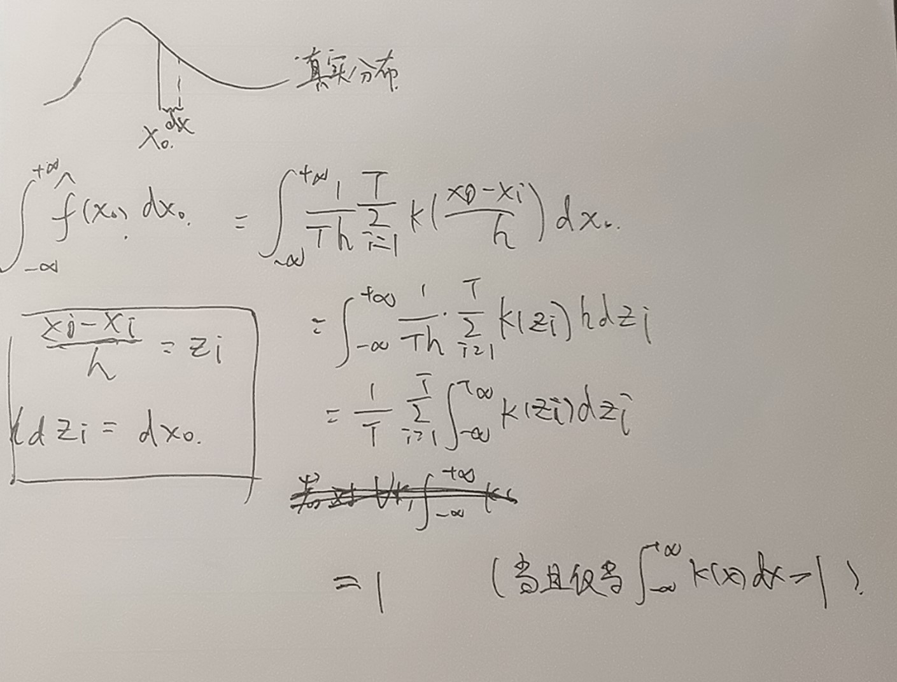

> 2022 计量2 课程内容

## 原理

想用非参数方法估计一个连续型随机变量的 pdf, 目前有样本 $x_1,\ldots, x_n$.

从连续型随机变量的pdf定义出发, 是概率分布函数的导数, $\lim_{h\to 0}\frac{F(x+h)-F(x-h)}{2h}$ ,
于是我们用这个式子来估计pdf. 

$$
PDF(x) = \frac{1}{2nh}\sum_{i=1}^n \mathbb{I}(\frac{x_i-x}{h}\leq 1)
$$

然后随便找点损失函数，用数值方法优化一下h，这样可以得到pdf的一个非参数估计

根据pdf的定义，h是应该趋于0的，那么上式中h该取0，但是由于样本数量有限，是抽样得来的，所以不能这样做。那么很自然的想到，在x的h邻域内的这些点也不应该有相同的权值，越靠近x对我估计的pdf的贡献应该越大，课程上这样引入了其他核函数。

上面使用的核函数就是简单的指示函数 $\mathbb{I}(\frac{x_i-x}{h}\leq 1)$ 在$x_i$于$x$距离不超过$h$时为1，其他为0. 新的核函数要让$x_i$于$x$距离不超过$h$时越靠近$x$权值越高，原理x权值就低。

## 问题

现在产生了两个问题：
1. 核函数是分段函数，把上面估计pdf的式子中的指示函数换成其他分段的核函数也会让产生的pdf有很多不可导的点，能否直接$x_i$于$x$距离不超过$h这个限制，通过核函数直接加权。比如核函数为标准正态分布pdf，核函数不分段，最后生成的一定是一个处处可导的pdf。
2. 什么样的核函数可用?

来看第二个问题，见到了两个核函数，标准正态分布pdf和

$$
k(x)= \begin{cases}
\frac{3}{4}(1-x^2),\quad &x\leq 1 \\
0,\quad & \text{otherwise}
\end{cases} 
$$

他们的特点是在$\mathbb{R}$上的积分都是1.

如果用 $k'(x)=100*k(x)$ 拟合出的pdf基本上是真实pdf的100倍

同学给出了一个简单证明：

但是如果从原理部分理解过来，并不能得知为什么这样的核函数能用。选取的核函数应该要和指示函数等价，也就是说对于一个$x$，样本落在$x$的$h$邻域的比例要和这些样本的核函数的和相等。不过由于我们正在估计这个随机变量的pdf，样本的分布是不知道的，我觉得无法推出这个条件。

