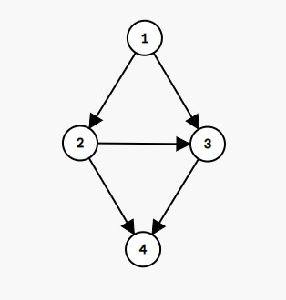

<!-- >我还没有非常仔细的想这个问题，也还没去查。这个问题可能非常简单，可能已经有人研究过这个问题了 -->

过年的时候听到一个考察小朋友的问题，家族中有多少对父子多少对爷爷和孙子，问家族中人数最少有几人。

把这个问题变成，考虑一个DAG，给出DAG中长度（边的数量）为 $l_i$ 的路径的数量 $a_i$ ，求出顶点数量最少的满足条件的DAG

- [一个更简单的版本?](#一个更简单的版本)
  - [2/6 点数的upperbound?](#26-点数的upperbound)
  - [也许 greedy 可行](#也许-greedy-可行)
- [DAG](#dag)
  - [$n$ 个点的DAG形成的长度为L的路径数量?](#n-个点的dag形成的长度为l的路径数量)


## 一个更简单的版本?

如果不是一般的 DAG ，而是一个 [arborescence](https://en.wikipedia.org/wiki/Arborescence_(graph_theory)) ？

嗯... $\|V\|=\|E\|+t$, $t$是树的个数. 

1. 长度越长的路径显然数量要少于长度短的路径数量
2. 如果只有一个约束(长度为$l$的路径数量是$a$), 可以贪心解决

### 2/6 点数的upperbound?

arborescence 情况下, 点数的上界是$\sum a_i(l_i+1)$.

($a_i(l_i+1)$的排序与$l_i$的排序应该是没什么关系的)

也许能够证明最优解中点数的上界是 $\max \{a_i(l_i+1)\}$ ?

---

arborescence 可以看成 [intersection of two matroids](https://math.mit.edu/~goemans/18433S07/arborescence.pdf)

然而我们关于长度为$L$的路径的数量的约束却并不是matroid. ground set 是一个 arborescence 森林中的边, 如果长度为$L$的路径数量小于等于$A$, 选择的边集就是一个independent set. 这种描述不能满足 exchange property.

(本来还想通过说明即使只有一个路径数量约束也是 intersection of three matroids 来证明即使是arborescence这个问题也是NP-Hard...不过就算成立也不能这样说明.)

---

### 也许 greedy 可行
把约束按照$L_i$从大到小排序, 对于一个长度是$L_i$的路径数量是$a_i$条这样的约束, 构造这样一个有向树:

```
O -> O -> ... -> O -> O
      \-> O       \-> O
       |-> O       |-> O
      ...         ...
```
在$L_i$对应的深度的顶点插入合适数量的儿子.

然后根据构造出的有向树中长度为更小的 $L_j$ 的路径的数量并修改 $a_j$. 

换一种描述方法: 假设根的深度是0. 用一个pair$(L_i, A_i)$来表示一个路径数量的约束(长度为$L_i$的路径有$A_i$条), 把这些pair按照 $L_i$ 的降序排序. 最优解的树形图形状像上面画的一样, 深度为$L_1$, 所有深度为$p$的顶点都是同一个深度为$p-1$的顶点的子节点. 深度为$L_1$的节点有$A_1$个, 深度为$L_i(i\geq 2)$ 的顶点有 $A_i-A_{i-1}+L_i-L_{i-1}+1$ 个.

<!-- ...想想怎么证明或者找反例 -->

**只有一个路径数量约束(长度为$L$的路径数量是$A$), $\|V\|=L+A-1$**

观察到对于$k$个路径约束, 使用的点数总共是


$$
\begin{align*}
|V|&=L_1+A_1-1+\sum_{i=2}^N A_i-A_{i-1}+L_i-L_{i-1}\\
&= A_N+L_N-1
\end{align*}
$$

也可以验证这样的构造恰好满足长度为$L_i$的路径有$A_i$条.

## DAG

不允许重边存在.

arborescence 情况下的贪心不再成立了, 比如这样的图: 



有向树的情况下是4个点是形成不了4条长度为2的路径的.

### $n$ 个点的DAG形成的长度为L的路径数量?

就是一个把能连接的边全部连接上的DAG吧。